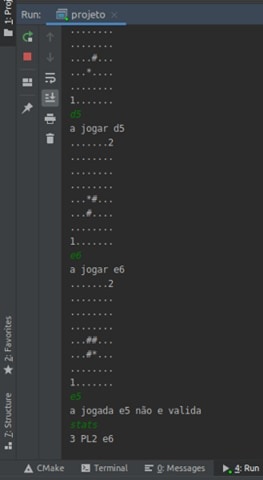
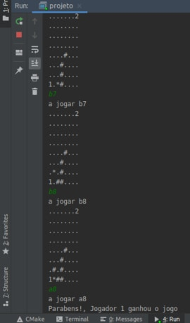
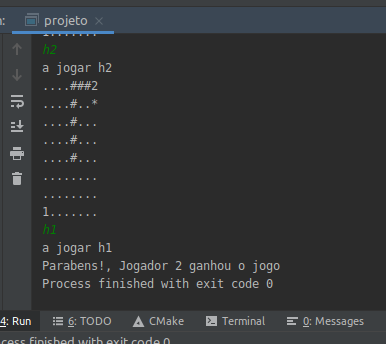
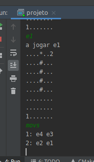
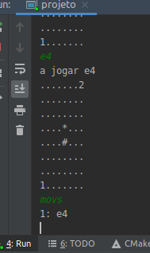
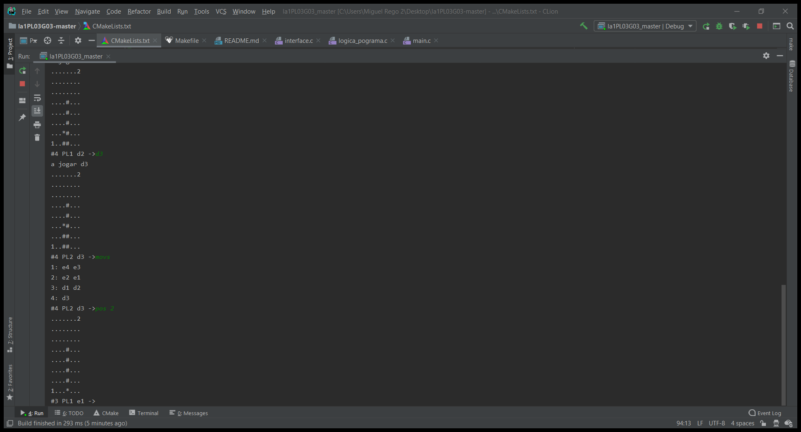
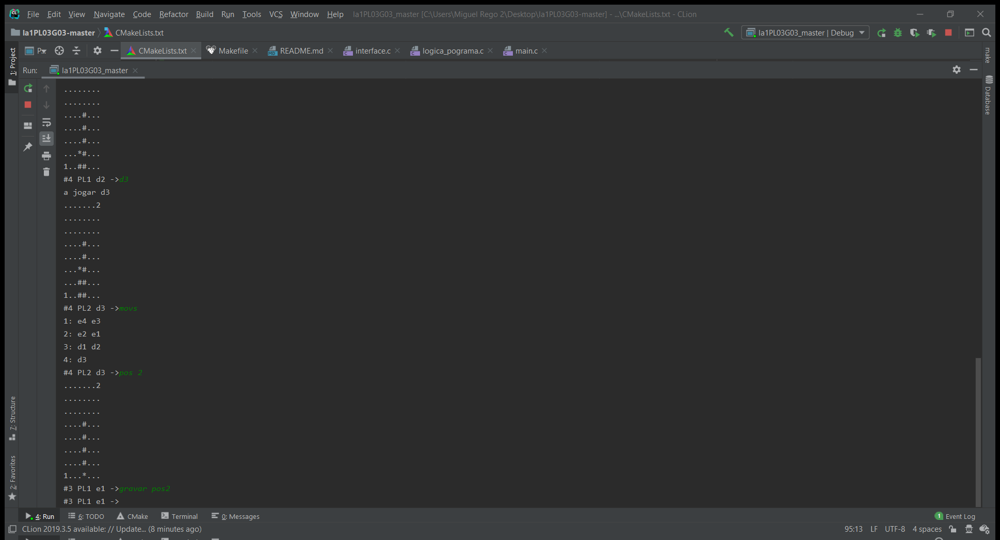
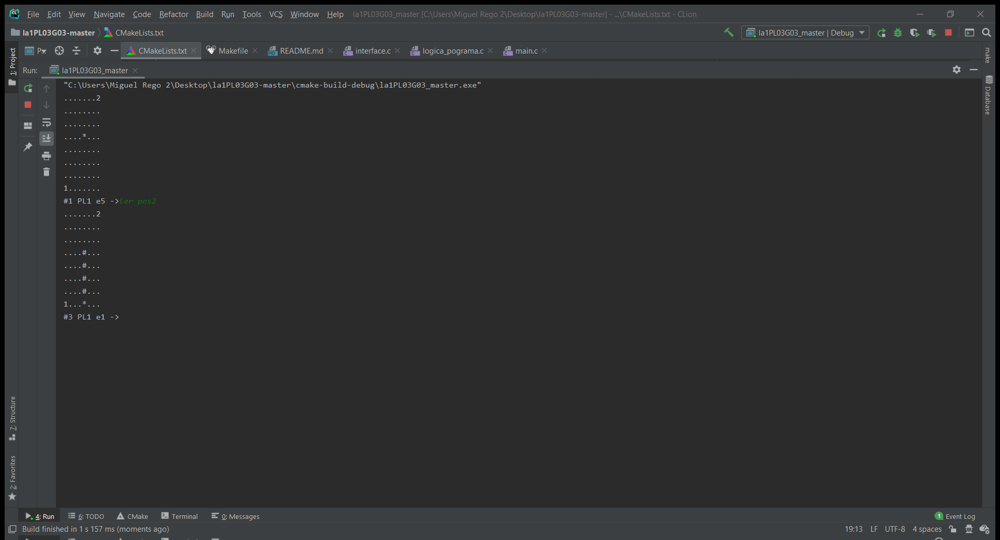
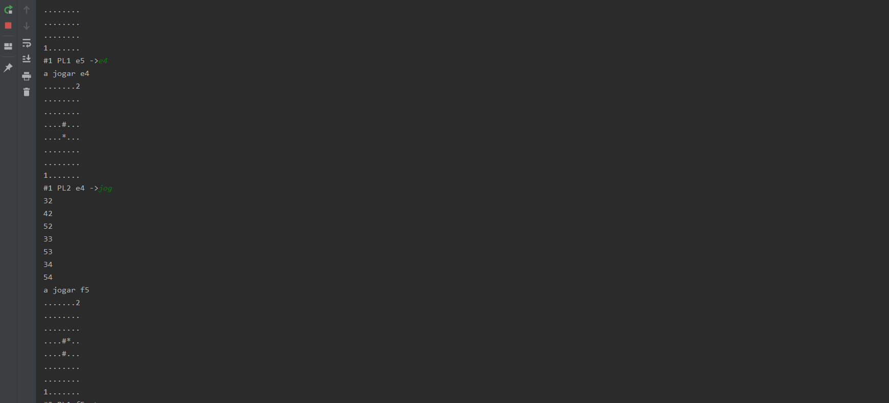
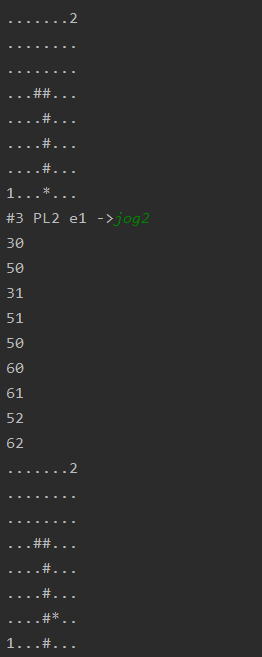

Figura 1 - Algumas jogadas efetuadas, na 4 jogada o jogador 1 fez uma jogada invalida ,e5, este só estava permitido a jogar para as coordenadas, f6,f7,e7,e5,f4

Figura 2 - Jogo completo, com vitoria para o jogador 1.

Figura 3 - Jogo completo, com vitoria para o jogador 2.

Figura 4 - Movs a funcionar com as coordenadas do PL1 e PL2.

Figura 5 - Movs a funcionar com as coordenadas do PL1.

Figura 6 - Comando Pos a funcionar com a segunda rodada do jogo.

Figura 7 - Comando gravar a gravar o estado num ficheiro txt.

Figura 8 - Comando ler a ler o estado num ficheiro txt previamente criado.

Figura 9 - Comando jog a executar uma jogada pelo jogador.

Figura 10 - Comando jog2 a executar uma jogada alternativa a jog pelo jogador 

